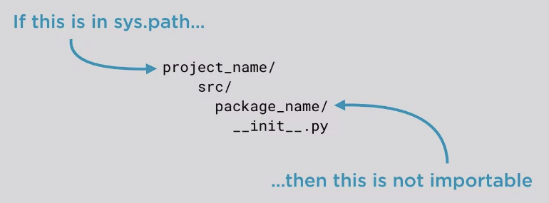

author: team dataplatform
id: python-package-tutorial
summary: This tutorial walks you through the anotomy and actions of a Python package
status: draft
feedback link: https://github.com/sonhal/python-pakke-1-2-3/issues

# Python package in 1-2-3

## About this tutorial

This tutorial walks you through Python packaging basics.


## Modules


## Packages

## Relative vs absolute imports

## Python package layout

Typical Python package layout
```
project_name/
    README.(rst/md)
    docs/
    package_name/
        __init__.py
        source.py
        sub_package_1/
            __init__.py
    tests/
        test_code.py

```

## src/ 



## Package Distribution

## Package plugins


